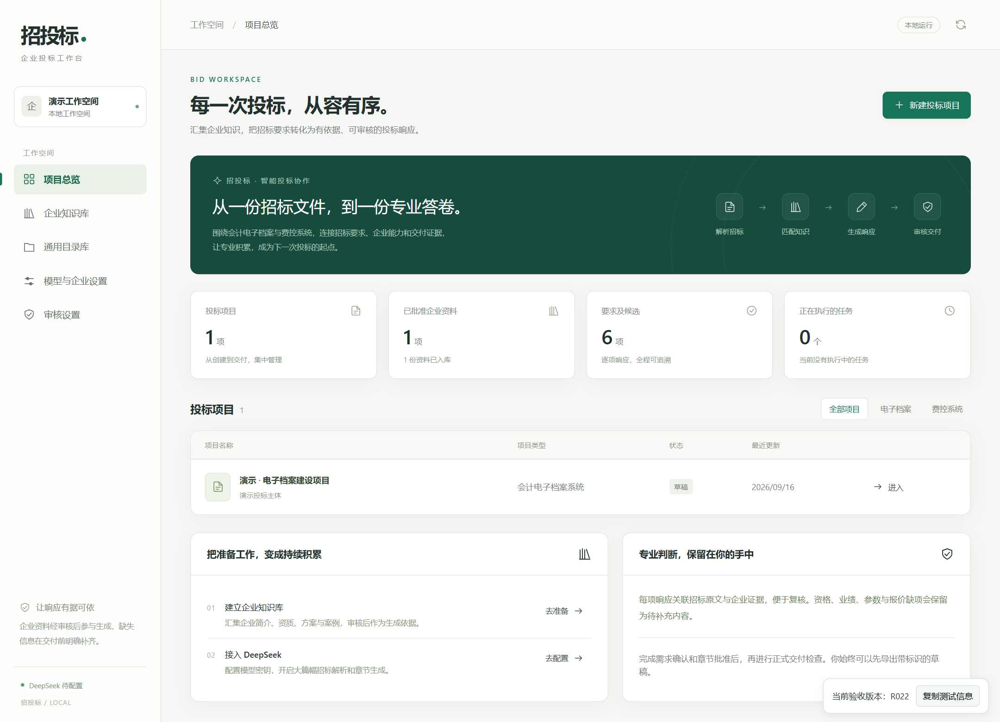
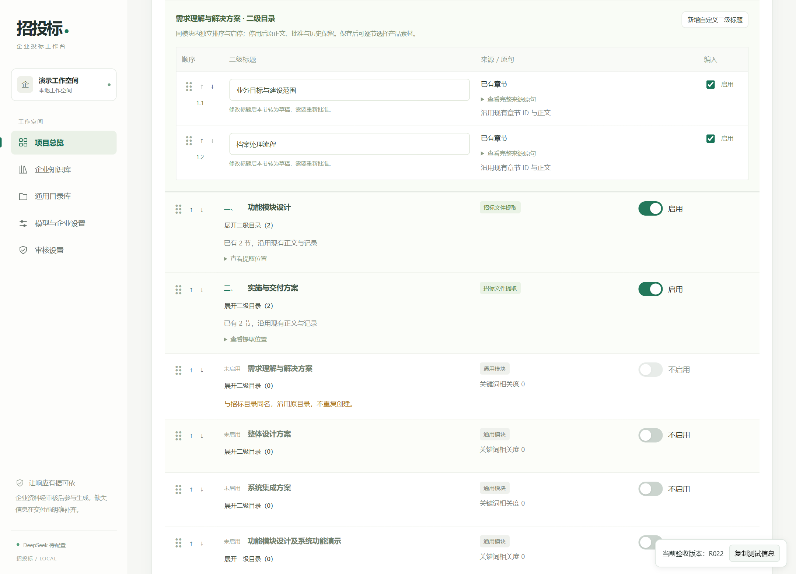
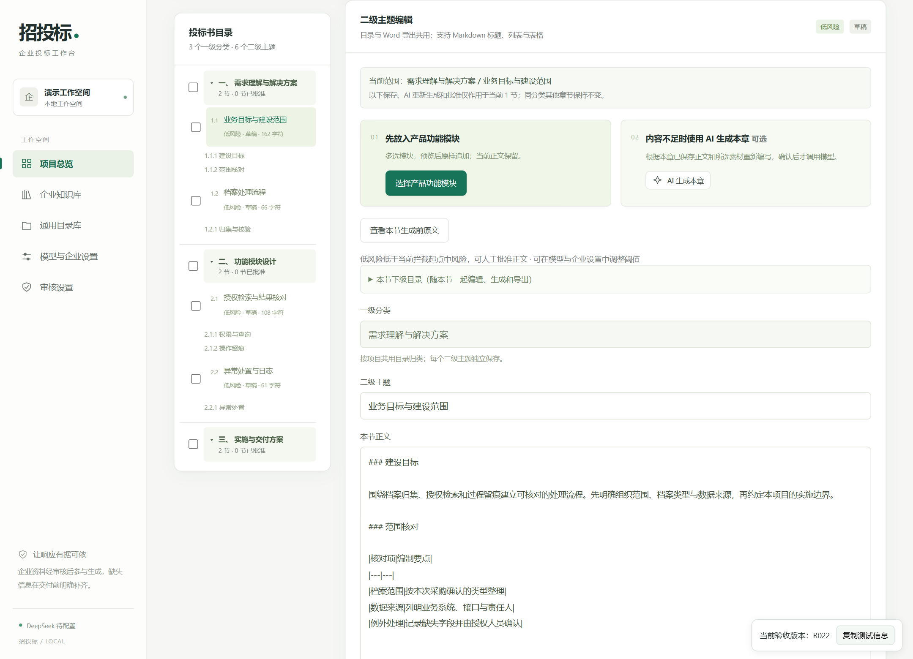
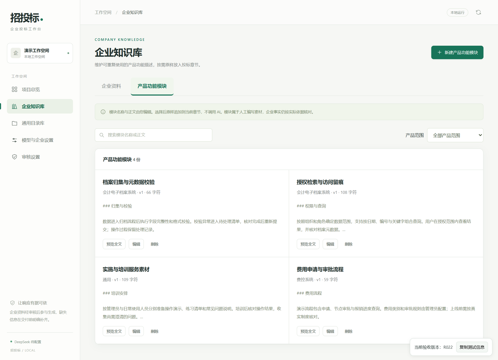

<div align="center">

# 招投标 · bidding

### 从招标文件，到有依据、可编辑的投标书

面向会计电子档案与费控项目的本地投标工作台。<br>
把企业资料、响应要求、编制目录与人工审核放在同一个工作空间。

[](https://github.com/guadventure12-ops/bidding/releases)   [](LICENSE)

[快速开始](#快速开始) · [产品亮点](#产品亮点) · [使用流程](#使用流程) · [运行边界](#运行边界)



<sub>所有截图均来自实际运行界面，使用合成演示数据，不含真实客户资料。</sub>

</div>

## 产品亮点

**资料先整理，目录可掌控，章节独立编写，交付前有人把关。**

| 工作环节 | 可以做什么 |
| --- | --- |
| 招标解析与要求台账 | 导入 DOCX、PDF、Markdown、TXT；调用模型分析采购要求，保留原文位置与引文。 |
| 企业知识库 | 导入企业资料，按产品范围筛选；支持批量批准与撤销，获准范围真正参与后续检索。 |
| 产品功能模块 | 手工维护可复用正文，多选、排序、预览后追加到指定章节；追加本身不调用模型。 |
| 一、二级编制目录 | 沿用标书明确规定；部分缺失时按评分细则补齐，通用目录由用户手选。二级支持改名、排序、启停。 |
| 单节 AI 与人工编辑 | 每节独立保存、重新生成和批准；保留人工素材、来源及历史，目录与导出共用定义。 |
| 审核与导出 | 规则检查和可选模型复核；导出可编辑 Word、同源 PDF，支持分册资料包与评审索引。 |

### 让目录贴合本次招标

已有正文不会因目录调整自动拆分。新增二级标题先建立空章节；停用保留原文与历史。明确规定的二级标题保持原文，评分建议保留出处供核对。

评分表推荐优先使用可读取的 DOCX。Markdown/TXT 目前按文本导入，其表格不保证保留列结构，需人工核对或手动编制目录。



### 每一节都能独立完成

先选择产品模块作为本节素材，再决定是否让 AI 完善。不需要为了修改一节重新生成整本。内容批准与报价、附件、签章准备分别处理。



### 将常用内容留在自己的资料库

企业资料与人工产品模块分开维护。资料批准有明确内容范围；产品模块不会自动成为已核验企业事实。



## 快速开始

推荐 **Windows 10/11 + Python 3.12**。本机安装 Microsoft Word 后可使用完整的分页、目录域刷新及 PDF 导出。模型功能需要您自己的 DeepSeek API Key，费用由对应账户承担。

在 PowerShell 中：

```powershell
git clone https://github.com/guadventure12-ops/bidding.git
cd bidding
py -3.12 -m venv .venv
.\.venv\Scripts\python.exe -m pip install -r requirements.txt
.\.venv\Scripts\python.exe run.py
```

打开 **[本地工作台](http://127.0.0.1:8765)**。保持此终端运行，按 `Ctrl+C` 停止服务。

首次打开是空工作空间，不包含账户密钥、企业资料、演示数据库或历史投标书。无需安装 Node.js、前端构建工具或开发助手运行时即可使用网站。快捷启动与可选 OCR 见 [安装说明](docs/INSTALL.md)。

### 不填密钥，先体验界面

合成演示数据由随附脚本在一个**新目录**中创建，不覆盖现有数据，也不调用模型：

```powershell
.\.venv\Scripts\python.exe scripts\create_demo.py --data-dir .\demo-data
$env:MX_DATA_DIR = (Resolve-Path .\demo-data).Path
$env:BIDDING_PORT = "8766"
.\.venv\Scripts\python.exe run.py
```

打开 **[演示工作台](http://127.0.0.1:8766)**。示例正文是人工编写的合成素材，不是模型效果或正式交付示范。停止服务并关闭此终端即可退出演示环境。

## 使用流程

1. **设置投标主体与模型**：填写企业名称、DeepSeek Key，检查连接并选择账户可用模型。无 Key 也可手工维护资料、目录和正文。
2. **整理企业资料**：上传企业材料，核对实际读取正文及适用范围，再批准可复用内容；需要时维护产品功能模块。
3. **新建项目并导入招标文件**：选择电子档案或费控类型。确认后执行 AI 分析，核对要求台账与来源。
4. **确认编制目录**：保留标书规定部分，核对评分建议，手选通用模块。保存一、二级目录后进入章节编辑。
5. **逐节选材与编写**：追加产品模块、手动编辑；不足的章节可单独确认 AI 生成。修改已批准正文后需要重新批准。
6. **审核与导出**：处理真实缺项，核对报价、附件及签章。可以先导出草稿；正式导出受当前审核和资料完整性检查约束。

> 页面角落显示实际运行的验收版本；“复制测试信息”包含构建指纹、代码提交与启动时间，便于定位反馈。

## 运行边界

- **本机单人工作台**：仅监听回环地址，未提供互联网部署所需的账号体系、租户隔离和多人权限管理。不要直接改成公网监听。
- **本地保存不等于所有操作离线**：上传材料保存在本机；您主动运行 AI 分析、生成或模型复核时，相关招标文本、获准资料及本节上下文会发送给 DeepSeek。遥测默认关闭，启用前需另行评估数据范围。
- **AI 生成仍需人工复核**：资料检索采用关键词/BM25，不是全库语义理解。OCR、表格结构和评分项提取可能遗漏；来源关联不等于报价、承诺、附件或签章已经确认。
- **Word 是完整导出的本机依赖**：当前交付流程依赖桌面版 Microsoft Word 完成分页与 PDF 转换。没有 Word 时不能把接口单元测试中的模拟分页当成真实导出能力。
- **不代办电子投标**：不执行电子签章、投标平台加密或自动递交，不保证任意招标方模板像素级还原，也不保证中标结果。
- **支持范围**：完整流程以 Windows 为目标；其他系统不是本次发布已验证的完整运行环境。

## 数据与安全

默认工作数据位于 `data/`：SQLite 数据库、上传文档、检查点和导出文件均不进入 Git。Windows 中保存的模型密钥使用当前用户的 DPAPI 加密；也可使用 `DEEPSEEK_API_KEY` 环境变量，勿将其写入源码。

仓库只包含应用源码、合成测试、演示素材及文档。第三方运行库通过包管理器安装，不随源码打包。备份和安全边界见 [SECURITY.md](SECURITY.md)，公开发布检查见 [发布验证记录](docs/RELEASE.md)。

## 开发与反馈

后端为 Python / FastAPI / SQLite，前端使用原生 JavaScript 与 CSS。接口文档在运行后的 `/api/docs`，接口定义在 `/openapi.json`。

```powershell
.\.venv\Scripts\python.exe -m pip install -r requirements-dev.txt
.\.venv\Scripts\python.exe -m pytest
```

测试使用隔离数据和模型替身，不需真实 Key；部分前端测试需 Node.js，真实 Word 测试与普通离线测试分开。安装要求和测试结果以 [发布验证记录](docs/RELEASE.md) 为准。

提交问题时请提供：操作步骤、期望与实际结果、页面版本及脱敏截图。**不要公开提交招标原件、报价、合同、客户资料或 API Key。**

欢迎通过 Issue 或 Pull Request 提出建议。公开读取、Fork 和提交 PR 不代表获得本仓库写入权限，合并由维护者决定。

## 许可

原创源码采用 [MIT](LICENSE)。第三方依赖适用各自许可证，尤其 PDF 处理使用的 PyMuPDF 提供 AGPL/商业双许可；组合发布或部署需另行遵守其要求，详见 [第三方许可说明](THIRD_PARTY_NOTICES.md)。
